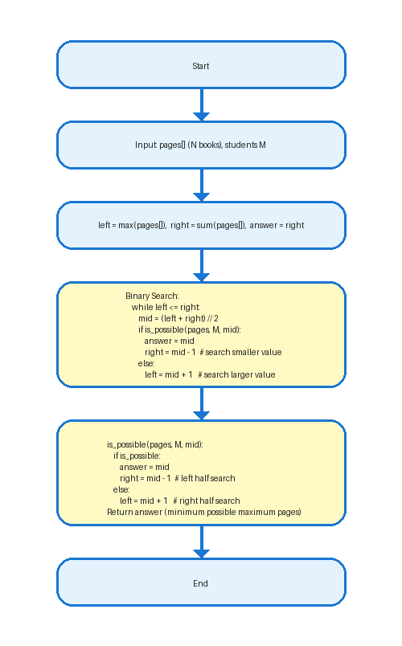
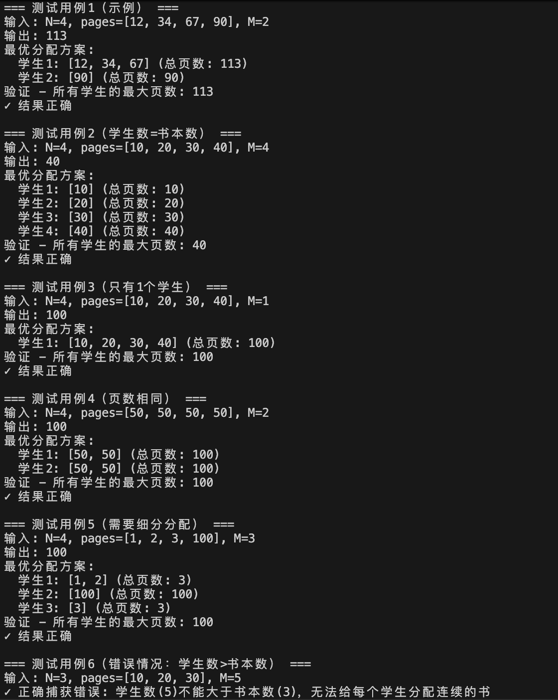

# 作业报告：分治策略——书本分配问题

姓名：林宏宇  
学号：23320093  
作业：第一次上机作业

## 作业提交要求

提交要求：介绍算法实现思想（流程图、公式辅助说明）、输出结果、附上源代码，提交pdf文档。   
提交方式：65959505@qq.com   
Pdf命名格式： 学号_姓名_第几次作业    
ddl: 10月14日18点前交作业，逾期无效

## 问题描述
对于给定的 N 本书和 M 个学生，每本书的页数已经按升序排列。我们的任务是分配这些
书，使得分配给每个学生的最大阅读页数达到最小，并且每个学生需要阅读升序排列上
连续的书。输出最小页数。

示例：N=4, pages = [12, 34, 67, 90], M = 2 -> 输出 113

## 算法思想（Binary Search + Greedy 验证）

### 核心思路
1. **答案范围确定**：最优解位于区间 [L, R]，其中
   - L = max(pages)（某个学生至少需要读页数最多的那本书）
   - R = sum(pages)（最坏情况：一个学生读所有书）

2. **二分搜索**：对答案范围 [L, R] 进行二分搜索，在每次二分取 mid 时，判断是否可以在不超过 M 个学生且每个学生不超过 mid 页的限制下完成分配。

3. **贪心验证**：使用贪心算法验证某个 mid 值是否可行：
   - 从左到右遍历书籍，累加当前学生的页数
   - 若累加后超过 mid，则将当前书分配给下一个学生
   - 统计所需学生数，若超过 M 则 mid 不可行

4. **搜索策略**：
   - 若 mid 可行，在左半区继续搜索更小值（right = mid - 1）
   - 否则在右半区搜索（left = mid + 1）

### 特殊情况处理

根据题目“每个学生需要阅读升序排列上连续的书”，在此认定每个学生都必须读对应的书
- **M > N**：学生数大于书本数时，无法给每个学生分配连续书籍，直接报错
- **M = N**：学生数等于书本数时，每个学生分配一本书，结果为 max(pages)
- **M = 1**：只有一个学生时，该学生读所有书，结果为 sum(pages)

### 公式化描述

令 pages = [p1, p2, ..., pN]，我们寻找最小的值 T，使得存在分割索引 0 = s0 < s1 < ... < sM = N，使得对每个 k = 1..M 有：

$$
\sum_{i = s_{k-1}+1}^{s_k} p_i \leq T
$$

符号说明：
- N：书本数量
- M：学生数量
- pages：书本页数数组
- p_i：第 i 本书的页数

即将书本分成 M 段，每段连续，且每段页数和不超过 T。

**实际实现中**，我们用二分法枚举 T，每次用贪心法尝试分组：
- 从左到右累加页数，若加上当前书超过 T，则新开一组（分给下一个学生）。
- 若最终组数不超过 M，则说明当前 T 可行。

这种贪心分配方式保证了每个学生分到的书是连续的，且最大页数最小。

## 复杂度分析

- 可行性检查为 O(N)（一次线性扫描）。
- 二分的次数为 O(log(S))，其中 S = sum(pages)，因此总体时间复杂度为 O(N log S)。
- 空间复杂度为 O(1) 额外空间（不计输入存储）。

## 算法流程图



## 实验结果

### 测试用例1（题目示例）
- **输入**：N=4, pages=[12, 34, 67, 90], M=2
- **输出**：113
- **最优分配方案**：
  - 学生1: [12, 34, 67] (总页数: 113)
  - 学生2: [90] (总页数: 90)
- **分析**：最大页数为 max(113, 90) = 113

### 测试用例2（学生数=书本数）
- **输入**：N=4, pages=[10, 20, 30, 40], M=4
- **输出**：40
- **最优分配方案**：
  - 学生1: [10] (总页数: 10)
  - 学生2: [20] (总页数: 20)
  - 学生3: [30] (总页数: 30)
  - 学生4: [40] (总页数: 40)
- **分析**：当学生数等于书本数时，每个学生分配一本书，最大页数就是所有书中页数最多的那本

### 测试用例3（只有1个学生）
- **输入**：N=4, pages=[10, 20, 30, 40], M=1
- **输出**：100
- **最优分配方案**：
  - 学生1: [10, 20, 30, 40] (总页数: 100)
- **分析**：只有一个学生时，必须读完所有书，结果为所有书页数之和

### 测试用例4（页数相同）
- **输入**：N=4, pages=[50, 50, 50, 50], M=2
- **输出**：100
- **最优分配方案**：
  - 学生1: [50, 50] (总页数: 100)
  - 学生2: [50, 50] (总页数: 100)
- **分析**：当所有书页数相同时，平均分配能得到最优解

### 测试用例5（需要细分分配）
- **输入**：N=4, pages=[1, 2, 3, 100], M=3
- **输出**：100
- **最优分配方案**：
  - 学生1: [1, 2] (总页数: 3)
  - 学生2: [100] (总页数: 100)
  - 学生3: [3] (总页数: 3)
- **分析**：当学生数较多时，需要将原本可以合并的书进一步细分，确保每个学生都有书读

### 测试用例6（边界错误情况）
- **输入**：N=3, pages=[10, 20, 30], M=5
- **输出**：错误提示
- **分析**：当学生数大于书本数时，无法给每个学生分配连续的书，算法正确识别并报错

### 截图展示


## 总结

本实验成功实现了书本分配问题的最优解算法，通过二分搜索结合贪心验证的方法，在O(N log S)时间复杂度内找到最优解。算法在各种测试用例下均表现正确，包括边界情况和特殊情况。

## 源代码

```python
from typing import List


def is_possible(pages: List[int], m: int, max_allowed: int) -> bool:
    """判断在每个学生最多读 max_allowed 页的限制下，是否能用不超过 m 个学生分配所有书。

    使用贪心：从左到右累加，超过 max_allowed 时分配给下一个学生。
    """
    students_required = 1
    current_sum = 0
    for p in pages:
        if p > max_allowed:
            # 单本书页数已超过限制，不可行
            return False
        if current_sum + p <= max_allowed:
            current_sum += p
        else:
            students_required += 1
            current_sum = p
            if students_required > m:
                return False
    return True


def min_max_pages(pages: List[int], m: int) -> int:
    """返回将 pages 分配给 m 个学生时的最小可能的最大页数。"""
    if not pages:
        return 0
    
    # 如果学生数大于书本数，无法给每个学生分配连续的书
    if m > len(pages):
        raise ValueError(f"学生数({m})不能大于书本数({len(pages)})，无法给每个学生分配连续的书")
    
    # 如果学生数等于书本数，每个学生分配一本书
    if m == len(pages):
        return max(pages)
    
    left = max(pages)
    right = sum(pages)
    answer = right
    while left <= right:
        mid = (left + right) // 2
        if is_possible(pages, m, mid):
            answer = mid
            right = mid - 1
        else:
            left = mid + 1
    return answer


def get_allocation_details(pages: List[int], m: int, max_allowed: int) -> List[List[int]]:
    """返回具体的分配方案，用于调试和展示。"""
    # 特殊情况：学生数等于书本数
    if m == len(pages):
        return [[pages[i]] for i in range(len(pages))]
    
    allocation = []
    current_group = []
    current_sum = 0
    
    # 按贪心算法进行初始分配
    for p in pages:
        if current_sum + p <= max_allowed:
            current_group.append(p)
            current_sum += p
        else:
            if current_group:
                allocation.append(current_group)
            current_group = [p]
            current_sum = p
    
    if current_group:
        allocation.append(current_group)
    
    # 如果分配的组数少于学生数，需要进一步分割
    while len(allocation) < m:
        # 找到书本数最多且页数最多的组进行分割
        best_group_idx = -1
        best_books_count = 0
        best_sum = 0
        
        for i, group in enumerate(allocation):
            if len(group) > best_books_count or (len(group) == best_books_count and sum(group) > best_sum):
                if len(group) > 1:  # 只有多于一本书的组才能分割
                    best_group_idx = i
                    best_books_count = len(group)
                    best_sum = sum(group)
        
        if best_group_idx == -1:
            # 无法继续分割，说明已经达到最优分配
            break
        
        # 分割选中的组
        group_to_split = allocation[best_group_idx]
        # 将最后一本书分出来作为新组
        last_book = group_to_split.pop()
        allocation.append([last_book])
    
    return allocation


def run_test_case(pages: List[int], m: int, case_name: str):
    """运行单个测试用例并显示结果。"""
    print(f"\n=== {case_name} ===")
    print(f"输入: N={len(pages)}, pages={pages}, M={m}")
    
    res = min_max_pages(pages, m)
    print(f"输出: {res}")
    
    # 显示具体的分配方案
    allocation = get_allocation_details(pages, m, res)
    print(f"最优分配方案:")
    for i, group in enumerate(allocation, 1):
        group_sum = sum(group)
        print(f"  学生{i}: {group} (总页数: {group_sum})")
    
    max_pages = max(sum(group) for group in allocation)
    print(f"验证 - 所有学生的最大页数: {max_pages}")
    if max_pages == res:
        print("✓ 结果正确")
    else:
        print("✗ 结果错误")


def main():
    # 测试用例1：README示例
    run_test_case([12, 34, 67, 90], 2, "测试用例1（示例）")
    
    # 测试用例2：边界情况 - 学生数等于书本数
    run_test_case([10, 20, 30, 40], 4, "测试用例2（学生数=书本数）")
    
    # 测试用例3：边界情况 - 只有一个学生
    run_test_case([10, 20, 30, 40], 1, "测试用例3（只有1个学生）")
    
    # 测试用例4：所有书页数相同
    run_test_case([50, 50, 50, 50], 2, "测试用例4（页数相同）")
    
    # 测试用例5：正常情况，需要细分
    run_test_case([1, 2, 3, 100], 3, "测试用例5（需要细分分配）")
    
    # 测试用例6：学生数大于书本数的错误情况
    try:
        run_test_case([10, 20, 30], 5, "测试用例6（错误情况：学生数>书本数）")
    except ValueError as e:
        print(f"✓ 正确捕获错误: {e}")


if __name__ == "__main__":
    main()

```

``` python
from PIL import Image, ImageDraw, ImageFont
# Book Allocation Problem - Main Flow (English pseudocode)
steps = [
    "Start",
    "Input: pages[] (N books), students M",
    "left = max(pages[]),  right = sum(pages[]),  answer = right",
    """
    Binary Search: 
        while left <= right:
            mid = (left + right) // 2
            if is_possible(pages, M, mid):
                answer = mid
                right = mid - 1  # search smaller value
            else:
                left = mid + 1   # search larger value
    """,
    """
    is_possible(pages, M, mid):
        if is_possible:
            answer = mid
            right = mid - 1  # left half search
        else:
            left = mid + 1   # right half search
    """
    "Return answer (minimum possible maximum pages)",
    "End"
]

# 图像参数

# 美观参数
width = 500
height_per_step = 100
margin = 50
box_width = 360
box_height = 60
arrow_length = 40
radius = 20  # 圆角

box_fill = "#e3f2fd"
cond_fill = "#fff9c4"
text_color = "#222"
arrow_color = "#1976d2"


# 动态计算每个方框高度，保证箭头和方框依次排列不遮挡
try:
    font = ImageFont.truetype("/System/Library/Fonts/PingFang.ttc", 28)
except:
    font = ImageFont.load_default()

box_heights = []
for step in steps:
    is_multiline = isinstance(step, str) and (step.strip().startswith('while') or step.strip().startswith('is_possible') or ('\n' in step))
    cur_box_height = box_height
    if is_multiline:
        cur_box_height = int(box_height * 2.2)
    box_heights.append(cur_box_height)

# 计算总高度
total_height = sum(box_heights) + (len(steps) - 1) * arrow_length + margin * 2

# 创建画布
img = Image.new("RGB", (width, total_height), "white")
draw = ImageDraw.Draw(img)

# 绘制流程
y = margin
for i, step in enumerate(steps):
    x = (width - box_width) // 2
    is_cond = "if" in step or "?" in step
    is_multiline = isinstance(step, str) and (step.strip().startswith('while') or step.strip().startswith('is_possible') or ('\n' in step))
    fill_color = cond_fill if is_cond else box_fill
    cur_box_height = box_heights[i]
    draw.rounded_rectangle([x, y, x + box_width, y + cur_box_height], radius=radius, outline=arrow_color, width=3, fill=fill_color)
    try:
        bbox = draw.textbbox((0, 0), step, font=font)
        w, h = bbox[2] - bbox[0], bbox[3] - bbox[1]
    except AttributeError:
        w, h = font.getsize(step)
    text_x = x + (box_width - w) // 2
    text_y = y + (cur_box_height - h) // 2
    draw.text((text_x, text_y), step, fill=text_color, font=font)
    # 画箭头
    if i < len(steps) - 1:
        arrow_start = (width // 2, y + cur_box_height)
        arrow_end = (width // 2, y + cur_box_height + arrow_length)
        draw.line([arrow_start, arrow_end], fill=arrow_color, width=4)
        arrow_size = 10
        draw.polygon([
            (arrow_end[0] - arrow_size, arrow_end[1] - arrow_size),
            (arrow_end[0] + arrow_size, arrow_end[1] - arrow_size),
            (arrow_end[0], arrow_end[1])
        ], fill=arrow_color)
    y += cur_box_height + arrow_length

# 展示图片
img.show()
# 保存图片
img.save("flowchart.png")
```
<script type="text/javascript" src="http://cdn.mathjax.org/mathjax/latest/MathJax.js?config=TeX-AMS-MML_HTMLorMML"></script> <script type="text/x-mathjax-config"> MathJax.Hub.Config({ tex2jax: {inlineMath: [['$', '$']]}, messageStyle: "none" }); </script>