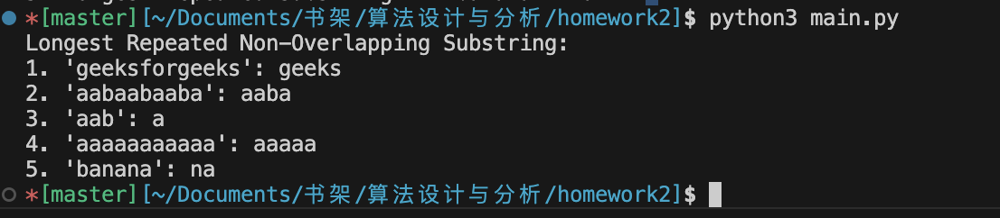

<div align="center">
    

<br><br><br>
</div>
<div style="font-size:1.6em; font-weight:normal; line-height:1.6;">
<div style="text-align:center; font-size:2.9em; font-weight:normal; letter-spacing:0.1em;">实验作业报告</div>
<br/>
<br>
<div style="text-align:center; font-size:1.3em; line-height:1.8;">
  <table style="margin: 0 auto; font-size:1.1em;">
  <tr><td align="right">实验：</td><td align="left">算法设计与分析</td></tr>
  <tr><td align="right">学号：</td><td align="left">23320093</td></tr>
  <tr><td align="right">姓名：</td><td align="left">林宏宇</td></tr>
  <tr><td align="right">专业：</td><td align="left">计算机科学与技术</td></tr>
  <tr><td align="right">班级：</td><td align="left">计科1班</td></tr>
  <tr><td align="right">指导教师：</td><td align="left">戴智明</td></tr>
  <tr><td align="right"style="border-bottom:1px solid #000;">实验日期：</td><td align="left" style="border-bottom:1px solid #000;">2025年11月2日</td></tr>
  </table>
</div>
</div>

<div STYLE="page-break-after: always;"></div>

# 算法设计与分析

## ✏️ 实验目的

### 上机作业
给定字符串，找出其中最长的重复出现并且非重叠的子字符串。
例子：
输入：str = "geeksforgeeks"
输出：geeks
输入：str = "aabaabaaba"
输出：aaba

### 提交要求
- 提交要求：介绍算法实现思想（流程图、公式辅助说明）、输出截图、附上源代码，提交pdf 文档。
- 提交方式：65959505@qq.com
- Pdf命名格式：学号_姓名_第二次作业
- 请各位同学11月4日18点前交作业，逾期无效

## 📋 实验内容

### 问题分析
本实验要求找出给定字符串中最长的重复出现并且非重叠的子字符串。这是一个经典的动态规划问题，关键在于：
1. 找到所有重复出现的子字符串
2. 确保子字符串不重叠
3. 在满足条件的子字符串中找到最长的

### 算法设计思想

#### 核心思路
采用动态规划方法，使用二维DP表 `dp[i][j]` 表示从位置 `i` 和位置 `j` 开始的最长公共前缀长度。

#### 算法流程
```
1. 创建 n×n 的二维DP表，其中 n 为字符串长度
2. 从字符串末尾开始向前填充DP表
3. 对于每个位置对 (i,j)，其中 j > i：
   - 如果 s[i] == s[j]，则 dp[i][j] = dp[i+1][j+1] + 1
   - 否则 dp[i][j] = 0
4. 在满足非重叠条件 (i + dp[i][j] <= j) 的情况下，
   记录最长的重复子字符串
```

#### 伪代码

```
算法：LongestRepeatedSubstring
输入：字符串 s
输出：最长重复非重叠子字符串

BEGIN
    n ← length(s)
    
    // 边界条件处理
    IF n < 2 THEN
        RETURN ""
    END IF
    
    // 初始化DP表
    CREATE dp[n][n] 初始化为0
    max_length ← 0
    ending_pos ← 0
    
    // 从后往前填充DP表
    FOR i ← n-1 DOWN TO 0 DO
        FOR j ← i+1 TO n-1 DO
            // 计算最长公共前缀
            IF s[i] = s[j] THEN
                IF i+1 < n AND j+1 < n THEN
                    dp[i][j] ← dp[i+1][j+1] + 1
                ELSE
                    dp[i][j] ← 1
                END IF
            ELSE
                dp[i][j] ← 0
            END IF
            
            // 检查非重叠条件并更新最大值
            IF dp[i][j] > max_length AND i + dp[i][j] ≤ j THEN
                max_length ← dp[i][j]
                ending_pos ← i
            END IF
        END FOR
    END FOR
    
    // 返回最长重复子字符串
    RETURN s[ending_pos : ending_pos + max_length]
END
```

#### 关键公式

**定义**：设字符串 $s$ 的长度为 $n$，$dp[i][j]$ 表示从位置 $i$ 和位置 $j$ 开始的最长公共前缀长度。

**状态转移方程**：

$$
dp[i][j] = 
\begin{cases}
dp[i+1][j+1] + 1, & \text{if } s[i] = s[j] \text{ and } i+1 < n \text{ and } j+1 < n \\\\
1, & \text{if } s[i] = s[j] \text{ and } (i+1 = n \text{ or } j+1 = n) \\\\
0, & \text{if } s[i] \neq s[j]
\end{cases}
$$

**约束条件**：
- $0 \leq i < j < n$（确保位置有序）
- $i + dp[i][j] \leq j$（非重叠条件）

**目标函数**：

$$
\max_{0 \leq i < j < n} \{dp[i][j] : i + dp[i][j] \leq j\}
$$

**最优解表示**：

设 $(i^{\*}, j^{\*})$ 为满足约束条件的最优位置对，则最长重复非重叠子字符串为：

$$
s[i^{\*} : i^{\*} + dp[i^{\*}][j^{\*}]]
$$

#### 算法流程图
```
开始
  ↓
初始化DP表 dp[n][n]
  ↓
i = n-1 to 0
  ↓
j = i+1 to n-1
  ↓
s[i] == s[j]? ────No───→ dp[i][j] = 0
  ↓                          ↓
  ↓Yes                       ↓
  ↓                          ↓
dp[i][j] = dp[i+1][j+1] + 1  ↓
  ↓                          ↓
  ↓                          ↓
满足非重叠条件? ←──────────────┘
  ↓
  ↓Yes
  ↓
更新最长长度和位置
  ↓
返回最长重复子字符串
  ↓
结束
```

### 运行结果

运行结果截图：



程序运行输出：
```
Longest Repeated Non-Overlapping Substring:
1. 'geeksforgeeks': geeks
2. 'aabaabaaba': aaba
3. 'aab': a
4. 'aaaaaaaaaaa': aaaaa
5. 'banana': na
```

### 测试用例分析

1. **"geeksforgeeks"** → **"geeks"**
   - "geeks" 在位置0和位置8重复出现
   - 长度为5，且不重叠（0+5 ≤ 8）

2. **"aabaabaaba"** → **"aaba"**
   - "aaba" 在位置0和位置6重复出现
   - 长度为4，且不重叠（0+4 ≤ 6）

3. **"aab"** → **"a"**
   - 只有字符"a"重复出现且不重叠

4. **"aaaaaaaaaaa"** → **"aaaaa"**
   - 最长的非重叠重复子字符串长度为5

5. **"banana"** → **"na"**
   - "na" 在位置2和位置4重复出现
   - 长度为2，且不重叠（2+2 ≤ 4）

### 时间复杂度分析
- **时间复杂度**：O(n²)，其中n为字符串长度
- **空间复杂度**：O(n²)，用于存储DP表

## 💡 实验总结

通过本次实验，我深入理解了动态规划在字符串处理中的应用。主要收获包括：

1. **算法设计**：学会了如何将复杂问题分解为子问题，并通过状态转移方程求解
2. **边界条件处理**：掌握了在动态规划中正确处理边界条件的重要性
3. **优化思路**：理解了非重叠条件的判断对于问题正确性的关键作用
4. **代码实现**：提升了将算法思想转化为具体代码的能力

该算法能够高效地找到最长的重复且非重叠子字符串，在字符串匹配、数据压缩等领域具有实际应用价值。


## 📚 参考资料
- 课件动态规划章节
- 课程作业要求

## 附件
- 源代码文件：main.py
```python

def longest_repeated_substring_dp(s):
    """
    思路：
    1. 创建二维DP表 dp[i][j] 表示从位置i和j开始的最长公共前缀长度
    2. 只考虑非重叠的情况（i + dp[i][j] <= j）
    3. 找出满足条件的最长子字符串
    """
    n = len(s)
    if n < 2:
        return ""

    # 初始化DP表
    dp = [[0] * n for _ in range(n)]
    
    max_length = 0
    ending_pos = 0
    
    # 从后往前填充DP表
    for i in range(n - 1, -1, -1):
        for j in range(i + 1, n):
            # 如果字符相同，则在之前的基础上+1
            if s[i] == s[j]:
                if i + 1 < n and j + 1 < n:
                    dp[i][j] = dp[i + 1][j + 1] + 1 # 继承后续的公共前缀长度
                else:
                    dp[i][j] = 1
            else:
                dp[i][j] = 0
            
            # 检查是否满足非重叠条件，并更新最大长度
            if dp[i][j] > max_length and i + dp[i][j] <= j:
                max_length = dp[i][j]
                ending_pos = i
    
    return s[ending_pos:ending_pos + max_length]

# Driver Code
if __name__ == "__main__":
    str1 = "geeksforgeeks"
    str2 = "aabaabaaba"
    str3 = "aab"
    str4 = "aaaaaaaaaaa"
    str5 = "banana"
    print("Longest Repeated Non-Overlapping Substring:")
    print(f"1. '{str1}': {longest_repeated_substring_dp(str1)}")  # Output: geeks
    print(f"2. '{str2}': {longest_repeated_substring_dp(str2)}")  # Output: aaba
    print(f"3. '{str3}': {longest_repeated_substring_dp(str3)}")  # Output: a
    print(f"4. '{str4}': {longest_repeated_substring_dp(str4)}")  # Output: aaaaa
    print(f"5. '{str5}': {longest_repeated_substring_dp(str5)}")  # Output: ana
```

<script type="text/javascript" src="http://cdn.mathjax.org/mathjax/latest/MathJax.js?config=TeX-AMS-MML_HTMLorMML"></script> <script type="text/x-mathjax-config"> MathJax.Hub.Config({ tex2jax: {inlineMath: [['$', '$']]}, messageStyle: "none" }); </script>